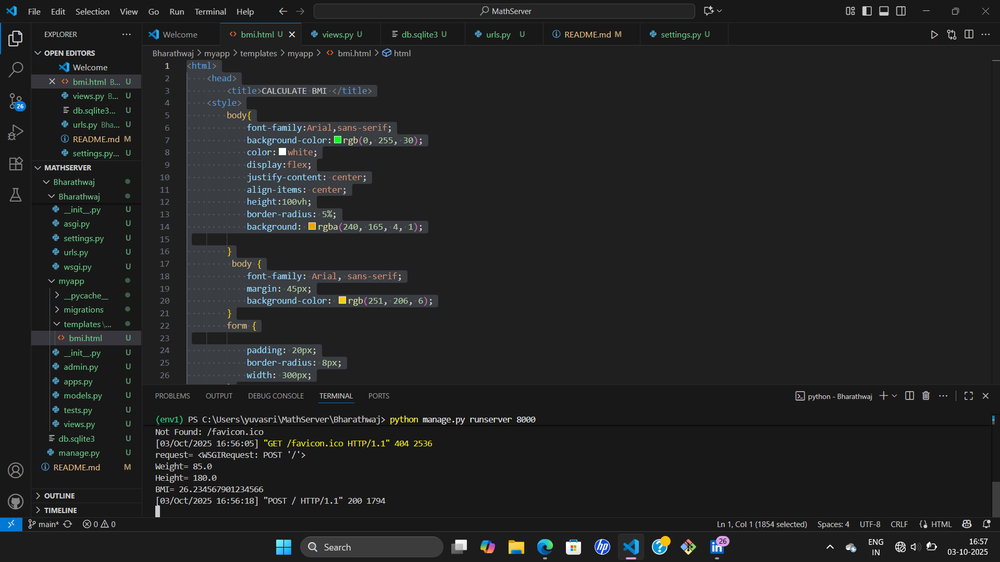

# Ex.05 Design a Website for Server Side Processing
## Date:3.10.2025

## AIM:
 To design a website to calculate the Body Mass Index (BMI) in the server side. 


## FORMULA:
BMI =W/H<sup>2</sup>
<br> BMI -->Body Mass Index
<br> W --> Weight
<br> H --> Height

## DESIGN STEPS:

### Step 1:
Clone the repository from GitHub.

### Step 2:
Create Django Admin project.

### Step 3:
Create a New App under the Django Admin project.

### Step 4:
Create python programs for views and urls to perform server side processing.

### Step 5:
Create a HTML file to implement form based input and output.

### Step 6:
Publish the website in the given URL.

## PROGRAM :
```
bmi.html
<html>
    <head>
        <title>CALCULATE BMI </title>
    <style>
        body{
            font-family:Arial,sans-serif;
            background-color:rgb(0, 255, 30);
            color:white;
            display:flex;
            justify-content: center;
            align-items: center;
            height:100vh;
            border-radius: 5%;
            background: rgba(240, 165, 4, 1);

        }
         body {
            font-family: Arial, sans-serif;
            margin: 45px;
            background-color: rgb(251, 206, 6);
        }
        form {

            padding: 20px;
            border-radius: 8px;
            width: 300px;
        }
        input {
            margin-top: 10px;
            width: 100%;
            padding: 8px;
        }
        h2 {
            margin-top: 20px;
        }
        .container {
            background-color: rgb(0, 0, 0);
            padding: 20px;
            border-radius: 8px;
            box-shadow: 0 0 10px rgba(0, 0, 0, 0.1);
            border-style: dashed;
        }
   </style>
</head>
<body>
    <center>
    <div class="container">
        <div class="cintainer">
                <h1>BMI CALCULATER</h1>
                <h1>Bharathwaj(25018022)</h1>
    <form method="post">
        
        <label for="height">HEIGHT [cm]:</label>
        <input type="text" id="height" name="height" required>

        <label for="weight">WEIGHT [kg]:</label>
        <input type="text" id="weight" name="weight" required>

        <input type="submit" value="CALCULATE_BMI">
    </form>

    
        <h2>YOUR BMI: {{ bmi }}</h2>
        
            <p>Category: {{ category }}</p>
        
    
        </div>
    </div>
    </center>
</body>
</html>


view.py
from django.shortcuts import render
def calculate_bmi(request):
    context={}
    context['bmi']="0"
    context['w']="0"
    context['h']="0"
    if(request.method=='POST'):
       w= float(request.POST.get('weight','0'))
       h=float(request.POST.get('height','0'))
       print('request=',request)
       
       print('Weight=',w)
       print('Height=',h)
       bmi=w/((h/100)**2)
       context['bmi']=bmi
       context['w']=w
       context['h']=h
       print('BMI=',bmi)
    return render(request,'myapp/bmi.html',context)

url.py

from django.contrib import admin
from django.urls import path
from myapp import views 

urlpatterns = [
    path('admin/', admin.site.urls),
    path('bmi/',views.calculate_bmi,name="bmi"),
    path('',views.calculate_bmi,name="bmicalculator")
]


```

## SERVER SIDE PROCESSING:


## HOMEPAGE:


## RESULT:
The program for performing server side processing is completed successfully.
